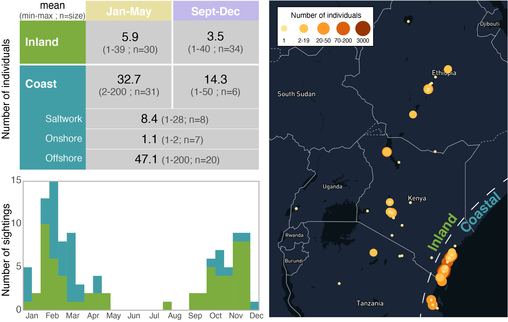
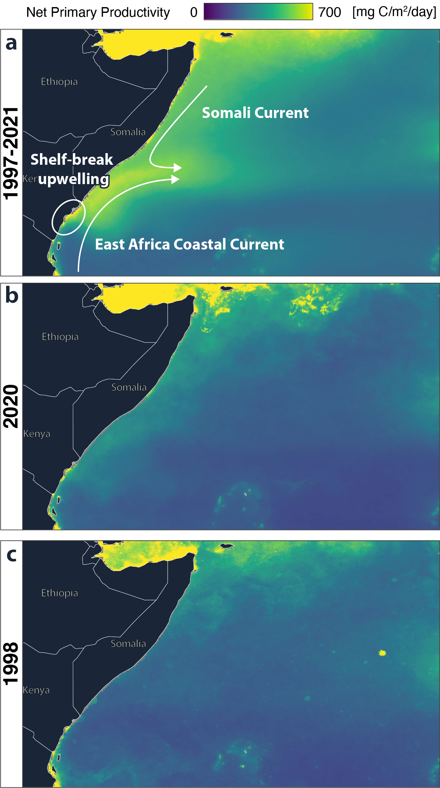

# Red-Necked Phalaropes in East Africa
Review of the red-necked phalarope sightings in East Africa and discussion of the influence that the extreme positive Inverse Ocean Dipole played in the influx of Red-necked phalaropes on the Kenyan Coast in February 2020.

This repository contains the data and code used for the peer-review paper:
> Nussbaumer, Raphaël, Mathieu Gravey, Améline Nussbaumer, and Colin Jackson. **2021**. “Investigating the Influence of the Extreme Indian Ocean Dipole on the 2020 Influx of Red-Necked Phalaropes *Phalaropus Lobatus* in Kenya.” *Ostrich* 1–9. doi: [10.2989/00306525.2021.1995908](https://doi.org/10.2989/00306525.2021.1995908).

*More than 3,000 Red-necked Phalaropes were observed 2 km off the Kongo estuary on the he shore on 9 February 2020.*

## Abstract
Ocean currents have wide-ranging impacts on seabird movement and survival. By extension, the extreme oscillations they are subject to, such as extreme Indian Ocean Dipole (IOD) events, can also be expected to dramatically influence seabird populations. This study links the extreme IOD event that occurred in 2019-2020 to the unusually high number of Red-necked Phalarope sightings observed in February 2020. We show that the extreme IOD event resulted in low net primary productivity (a measure of plankton growth) offshore from the Somalia-Kenyan coast, where Phalaropes have been tracked in previous winters. We suggest that Phalaropes were therefore forced to move closer to the coast to find food at river estuaries, thus explaining the influx in February 2020. This study calls for closer monitoring of seabird populations in East Africa, particularly during extreme IOD events, which are expected to become more common in the future. 

## Data

### Sigthings in East Africa
We reviewed existing literature and perform an exhaustive search of all previous records for this species across East Africa (Ethiopia, Kenya, Tanzania, Uganda), as recorded in literature (East African Bird Rarity, Scopus, African Bird Club Bulletin) and on citizen science databases (eBird, 2020; KenyaBirdMap, 2020). All sightings can be find in [`sightings.csv`](R_code/sightings.csv).

*Summary of the 105 sightings in East Africa (Ethiopia, Uganda, Tanzania, Kenya) found in the literature and citizen science platform ranging from 1962 to 2020.*

### Net Primary Productivity in East Africa
(Oceanic) Net Primary Productivity (NPP) is a useful proxy for the presence of planktonik species on which Red-necked phalaropes feeds as it can be measured with remote sensing (sattelite). We used measurement of NPP during normal and extreme Inverse Ocean Dipole year to illustrate the variation in food availability for Red-necked Phalaropes. 
The NPP data are computed with the Vertically Generalized Production Model (VGPM) algorithm (Behrenfeld & Falkowski, 1997) retrieved from [ocean.productivity](http://sites.science.oregonstate.edu/ocean.productivity/) (O’Malley, 2020) and analyzed with [Google Earth Engine](https://earthengine.google.com/) (Gorelick et al., 2017). 

An [interactive and comparative map of NPP between years](https://rafnuss.users.earthengine.app/view/net-primary-productivity) has been developed for visualizing the year to year variation.

*Map of Net Primary Productivity (NPP) averaged for Jan-Mar on the western Indian Ocean. In “usual” years (1997-2021 – average of all years available), a bloom is visible offshore of the Kenyan-Somalian border. However, during years with a strong positive IOD (1998 and 2020), this bloom is absent.*

## Analysis

The analysis of these data and the generation of the figures was performed with [a Rmarkdown file](R_code/Red-necked_Phalarope_publication.html). 

## How to cite?

> Nussbaumer, Raphaël, Mathieu Gravey, Améline Nussbaumer, and Colin Jackson. **2021**. “Investigating the Influence of the Extreme Indian Ocean Dipole on the 2020 Influx of Red-Necked Phalaropes *Phalaropus Lobatus* in Kenya.” *Ostrich* 1–9. doi: [10.2989/00306525.2021.1995908](https://doi.org/10.2989/00306525.2021.1995908).
